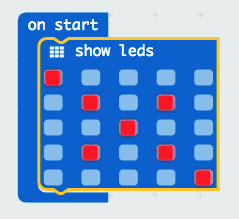

## Design your image

1. Connect the micro:bit to your computer using the USB cable

2. Open the MakeCode webpage ([makecode.microbit.org](https://makecode.microbit.org/)) or run the offline versions (pxt serve)

3. Drag these blocks from the **Basic** group

    

4. Design your own image for LEDs

5. Click Download and then follow the instructions to copy the `.hex` file to your Micro:Bit. The LEDS on the Micro:Bit should light up and show your pattern.

