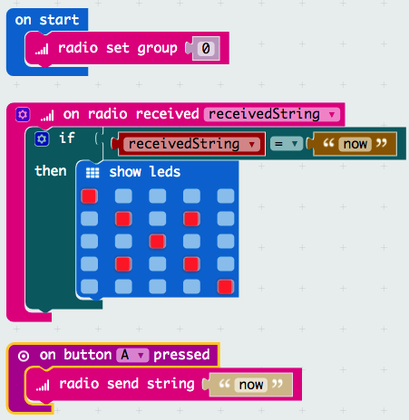

## Set up the radio

1. Add the **radio set group** block.

2. Now add an input block that will trigger when Button A is pressed, and fill it with a **radio send string** block. Enter some text to send as the message.

    

3.  Move your **show leds** block and add an **if... then** block so that it is only triggered when a radio message with the same text is received.

    

4. Find someone else who is at the same point and test your code.  Does pressing the A button cause their image to appear on their Micro:Bit?

    

    

5. Can you add a **pause** and a **clear screen** block so that the image disappears after a few seconds?
