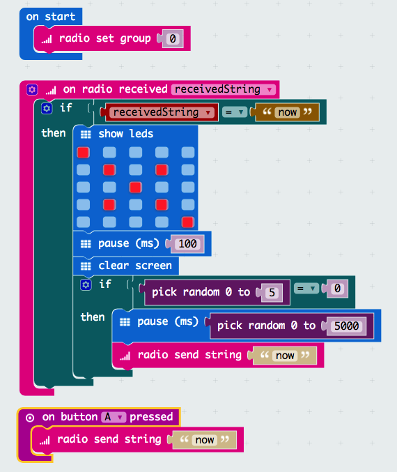

## Triggering an avalanche of messages

1. The micro:bits should sometimes re-broadcast the message after they have received it. Use the **pick random** function to choose a number and only transmit the message again if it matches a certain value.

1. Use the random block again to include a slight pause of up to 5 seconds before re-transmission

    

1. Test your code as group. depending on how many micro:bits are taking part, you should adjust the random values so that avalanches occur with a frequency you're happy with.  

1. Work as a group to extend the project

  - Modify the code that so pressing button B has a different effect
  - Can you coordinate your micro:bits so that pressing a button on one causes a text message to be displayed on the micro:bits one letter at a time?
